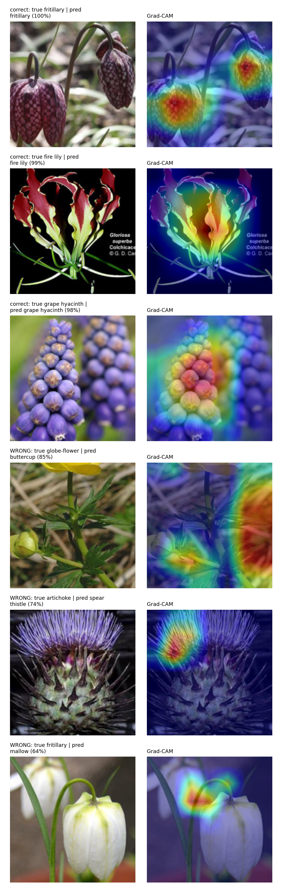

# Flowers-102 Transfer Learning

Transfer learning on Oxford Flowers-102 in PyTorch, trained entirely on a CPU.
The dataset gives you **10 labelled images per class** for 102 classes and then
asks you to classify 6,149 test images, so the whole project is about getting
the most out of an ImageNet-pretrained backbone — and about measuring the result
honestly.

Two regimes are implemented and compared:

- **Linear probing** — freeze the backbone, run each image through it once,
  cache the pooled features, and train a small head on those cached tensors.
  About two minutes per run on a CPU.
- **Fine-tuning** — unfreeze everything and train end to end at a lower learning
  rate with augmentation and a cosine schedule.

## Results

Held-out test split, 6,149 images. Intervals are 2,000-sample bootstraps; every
model was selected on validation only, and trained on a CPU.

| run | top-1 | 95% CI | top-5 | balanced acc | train time |
| --- | ---: | :---: | ---: | ---: | ---: |
| ResNet-18 probe | 0.8310 | [0.8216, 0.8401] | 0.9550 | 0.8511 | 132 s |
| ResNet-50 probe | 0.8528 | [0.8440, 0.8621] | 0.9632 | 0.8640 | 311 s |
| **EfficientNet-B0 probe** | **0.8697** | [0.8611, 0.8784] | 0.9645 | **0.8831** | 189 s |
| ResNet-18 fine-tune | 0.8413 | [0.8314, 0.8504] | 0.9489 | 0.8687 | 1,510 s |

Three things I did not expect going in:

- **Swapping the backbone beat fine-tuning.** The EfficientNet-B0 probe is 2.8
  points ahead of the ResNet-18 fine-tune and trains 8x faster.
- **Fine-tuning ResNet-18 did not clearly beat probing it.** +1.0 point, but the
  confidence intervals overlap — for 215x the trainable parameters. Its
  validation accuracy was still rising when the 12-epoch CPU budget ran out, so
  that is a floor rather than a verdict.
- **Every model is underconfident, not overconfident.** ECE ≈ 0.34: the best
  model averages 0.53 confidence while being right 87% of the time, which is the
  label smoothing showing up in the probabilities.

Full tables, per-class metrics and figures: [`reports/`](reports/) and
[`DOCUMENTATION.md`](DOCUMENTATION.md).

## What is in here

- Three interchangeable backbones (ResNet-18/50, EfficientNet-B0) behind one
  registry, each stripped to a feature extractor.
- A frozen-feature cache that makes linear probing ~40x cheaper than the naive
  loop, with the two subtleties that make cached features correct: no
  augmentation, and no dropped final batch.
- One training loop shared by both regimes: AdamW, cosine annealing, label
  smoothing, early stopping, best-checkpoint restore.
- An evaluation harness that goes past top-1: per-class precision/recall/F1,
  balanced accuracy, bootstrap confidence intervals, expected calibration error,
  confusion matrix, reliability diagram.
- Grad-CAM, including for frozen backbones, and a script that explains the most
  confident *mistakes* rather than only the successes.
- Self-describing checkpoints (weights + config + metrics), so `evaluate`,
  `predict` and `explain` never need to be told the architecture.
- 96 tests that run without downloading the dataset.

## Grad-CAM



ResNet-18 probe. Top three rows are its most confident correct predictions; the
bottom three are its most confident mistakes. The globe-flower misclassified as a
buttercup is the instructive one — the heatmap sits on background grass rather
than on the bloom.

## Quick start

```bash
pip install -r requirements.txt

# Train a linear probe (downloads the ~345 MB dataset on first run)
PYTHONPATH=src python -m imgclf.cli train \
    --backbone resnet18 --mode linear_probe --epochs 40 \
    --output-dir checkpoints/resnet18_probe

# Score it on the test split and write metrics + figures
PYTHONPATH=src python -m imgclf.cli evaluate \
    --checkpoint checkpoints/resnet18_probe/best.pt --split test \
    --report-dir reports/resnet18_probe \
    --history checkpoints/resnet18_probe/history.json

# Classify one image, then see where the model looked
PYTHONPATH=src python -m imgclf.cli predict \
    --checkpoint checkpoints/resnet18_probe/best.pt --image flower.jpg
PYTHONPATH=src python -m imgclf.cli explain \
    --checkpoint checkpoints/resnet18_probe/best.pt \
    --image flower.jpg --output gradcam.png
```

Reproduce every row of the results table:

```bash
PYTHONPATH=src python scripts/run_experiments.py --data-root data
```

## Layout

```
src/imgclf/
├── config.py          typed, validated, YAML-serialisable configuration
├── data/              transforms, Flowers102 loaders, feature-cache loader
├── models/            backbone registry + transfer head
├── training/          feature cache, shared training loop, checkpoints
├── eval/              metrics and figures
├── interpret/         Grad-CAM and its rendering
├── inference.py       checkpoint -> model, batch scoring, single-image predict
└── cli.py             train | evaluate | predict | explain
scripts/
├── explore_data.py       dataset summary
├── run_experiments.py    the full sweep behind reports/results.md
└── gradcam_examples.py   the figure above
tests/                 96 tests, dataset faked at the torchvision boundary
```

## Tests

```bash
PYTHONPATH=src python -m pytest -q
```

`tests/conftest.py` fakes `torchvision.datasets.Flowers102`, so the suite needs
no download and runs in well under a minute.

## Further reading

[`DOCUMENTATION.md`](DOCUMENTATION.md) covers the architecture, the methodology,
the engineering tradeoffs (including what is wrong with the probe/fine-tune
comparison), and how to extend the project.

## License

MIT
